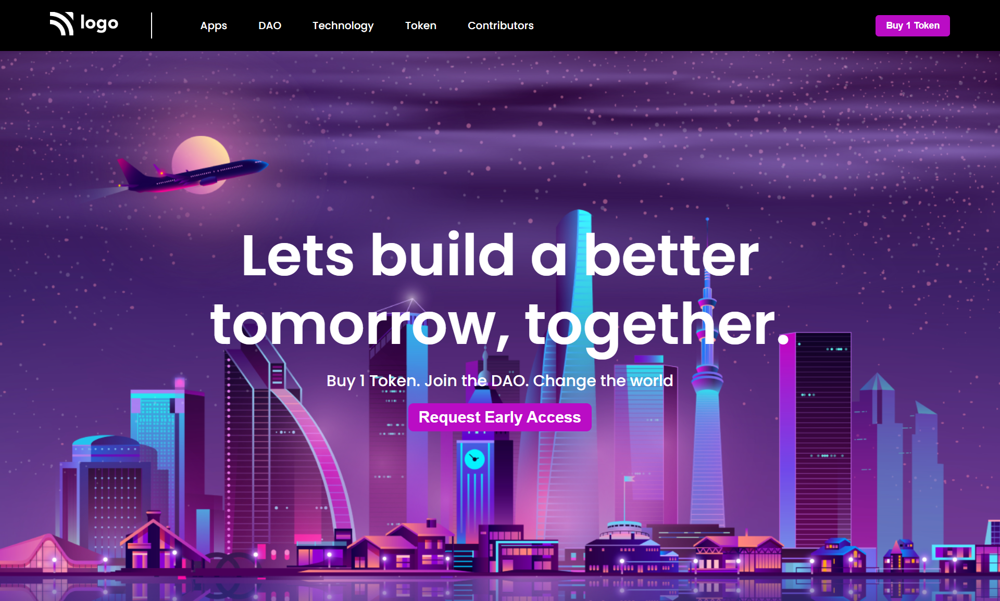

# Hey Welcome Buddy 👋

### This is Rohit Madeshiya. Passionate to become a Full Stack Developer.

 

## Name of Project : **Crypto Landing Page**

 
 

> In this is Project Basically i learnt about flexbox that where and how to use flexbox in our Web Project. And i also get to know that we can not make a fancy or modern looking website without using flexbox as per my experience.

 
 

### This is How My Project is looking on Desktop.

 
 

Your Can Check it live on below link :

[Crypto Landing Page !!!](https://crypto-landing-page-rohit.netlify.app/ "Crypto Landing Page By Rohit Madeshiya")
